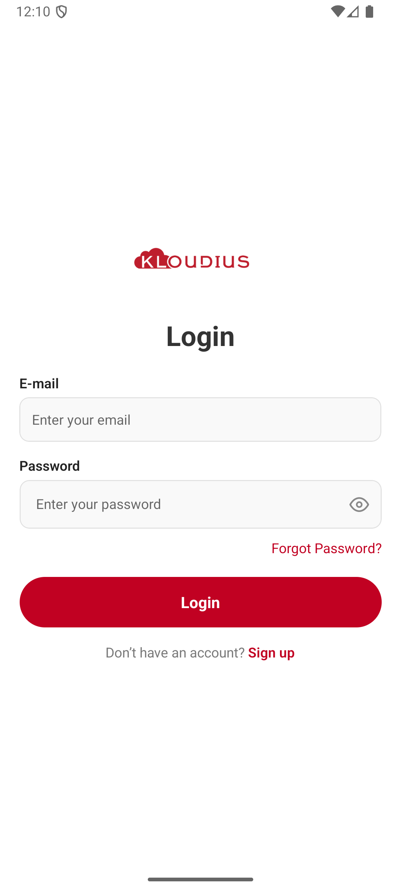

# User Authentication App (React Native)

A simple, clean authentication flow built with **Expo**, **React Navigation**, and **React Context API**. It includes **Login**, **Signup**, and **Home** screens with persisted auth state via **AsyncStorage**, inline validation, and a brand‑consistent UI.

---

## 🚀 Getting Started

### 1) Prerequisites

- Node.js 18+ (recommended)
- npm or yarn
- Xcode (for iOS) / Android Studio (for Android)
- Expo CLI (`npx expo` comes with `expo` package scripts)

### 2) Install

```bash
npm install
# or
yarn
```

### 3) Run (iOS Simulator)

```bash
npm run ios
# or
npx expo start --ios
```

### 4) Run (Android Emulator)

```bash
npm run android
# or
npx expo start --android
```

### 5) Run (Expo Go)

```bash
npm start
# choose: i (iOS), a (Android), w (Web)
```

> If you previously used `expo-router`, ensure your `package.json` has:
>
> ```json
> "main": "node_modules/expo/AppEntry.js"
> ```
>
> and there are no router plugins.

---

## 📦 Dependencies

- **expo** (Expo SDK)
- **@react-navigation/native**
- **@react-navigation/native-stack**
- **react-native-screens**, **react-native-safe-area-context**
- **@react-native-async-storage/async-storage**
- **@expo/vector-icons** (icons for password toggle)

Install (if setting up from scratch):

```bash
npm install @react-navigation/native @react-navigation/native-stack
npx expo install react-native-screens react-native-safe-area-context
npx expo install @react-native-async-storage/async-storage
```

---

## ✨ Features

### Auth Context (`AuthContext.tsx`)

- `login(email, password)`
- `signup(name, email, password)`
- `logout()`
- `user` (public shape: `{ name, email }`)
- `ready` flag to gate UI until bootstrap completes
- Seed demo user: `test@user.com / 123456`
- Persists current user with **AsyncStorage**

### Screens

#### Login

- Email & Password inputs
- Field validation (required, email format)
- Incorrect credential error
- Password visibility toggle (eye icon)
- “Don’t have an account? Sign up”

#### Signup

- Name, Email, Password, Verify Password
- Field‑level validation with inline errors
- Password visibility toggles for both fields
- “Already have an account? Log in”

#### Home

- Shows logged‑in user’s name & email
- Logout button (returns to Login stack)

### Navigation

- **React Navigation** (Native Stack)
- Auth stack (Login/Signup) vs App stack (Home) switches based on `user`

### UI

- Clean, modern layout
- **Kloudius-inspired color palette**
- Brand logo on auth screens
- Accessible touch targets and error text

---

## 🧱 Project Structure (Core files only)

```
root/
  App.tsx
  src/
      Context/
          AuthContext.tsx
      screens/
          LoginScreen.tsx
          SignupScreen.tsx
          HomeScreen.tsx
      # Support (already included in the repo)
      constants/
          Colors.ts
      assets/
          images/
              kloudius.webp
```

---

## 🔐 Authentication Flow

- On app launch, `AuthContext`:

  - Loads saved **users** and **current user** from AsyncStorage.
  - Seeds demo user if no users exist.
  - Sets `ready=true` to render UI.

- **App.tsx** renders:

  - **Auth Stack** (Login/Signup) if `user === null`
  - **App Stack** (Home) if `user` exists

- **Login**

  - Validates email format & required fields
  - Verifies credentials against persisted users

- **Signup**

  - Validates required fields, email format, password length, and **password match**
  - Adds new user to users list and auto‑logs in

- **Logout**

  - Clears `user` in storage & state (App reverts to Auth Stack automatically)

---

## 🧪 Demo Credentials

```
Email:    test@user.com
Password: 123456
```

Or create a new account via **Signup**.

---

## 🖼️ Screenshots / Video (What to capture)

1. **Login**

   - Invalid email format error
   - Wrong credentials error

2. **Signup**

   - Missing field error(s)
   - Password < 6 chars error
   - Passwords do not match
   - Successful signup → navigates to Home

3. **Home**

   - Shows name & email
   - Logout → back to Login

_(A short screen recording showing Login → Signup → Home → Logout is perfect.)_

---

## 🧰 Troubleshooting

- **“Cannot use JSX unless the '--jsx' flag is provided”**

  ```json
  { "compilerOptions": { "jsx": "react-native" } }
  ```

- **Metro cache / odd bundling issues**

  ```bash
  npx expo start -c
  ```

- **Strong Password autofill yellow overlay on iOS**

  - That’s iOS UI. You can use `backgroundColor: 'transparent'` on the `TextInput` or disable suggestions (not recommended).

---

## 📄 Notes

- Passwords are stored **in plaintext** for demo purposes only (per assignment scope). Do **not** use this approach in production.
- All navigation is typed; no `any` usage in handlers.

---

## ✅ What’s Implemented vs. Assignment

- AuthContext with **login / signup / logout / user** ✔️
- Screens: **Login / Signup / Home** ✔️
- Validation & inline error messages ✔️
- Navigation via **React Navigation** ✔️
- **AsyncStorage** persistence ✔️
- **Password visibility toggle** ✔️
- README + screenshots guidance ✔️

## Screenshots

Screenshots and recording are attached in the `screenshots` folder

## iOS


## Android




